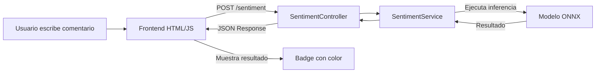

# Documentación de Aportes de Augusto Paz- Proyecto SentimentAPI

> **Equipo 31 - Hackathon Latinoamérica**

---

# PARTE 1: Integración del Modelo ONNX

> Documentación de todo lo que hice para conectar el modelo de IA con el backend

---

## Resumen

Me encargué de integrar el modelo ONNX que entrenaron los chicos con el backend Spring Boot. Básicamente, el sistema ahora puede recibir un comentario, analizarlo con el modelo de Machine Learning, y devolver si es positivo o negativo con un porcentaje de confianza.

---

## Arquitectura



---

## Lo que tuve que modificar

### 1. pom.xml - Agregar ONNX Runtime

Lo primero fue agregar la librería de Microsoft para poder ejecutar modelos ONNX en Java.

```xml
<!-- Esta es la librería que permite ejecutar el modelo -->
<dependency>
    <groupId>com.microsoft.onnxruntime</groupId>
    <artifactId>onnxruntime</artifactId>
    <version>1.19.0</version>
</dependency>
```

**Importante:** Tuve que usar la versión 1.19.0 porque el modelo tiene IR version 10. Con la 1.16.3 tiraba error de versión incompatible.

---

### 2. SentimentService.java (archivo nuevo)

Este es el archivo principal que creé. Se encarga de:
- Cargar el modelo ONNX cuando arranca la app
- Recibir el texto y pasarlo al modelo
- Interpretar lo que devuelve el modelo

Lo más importante del código:

```java
// El modelo espera un array 2D, no 1D. Me costó darme cuenta de esto.
String[][] inputData = new String[][] {{ texto }};
OnnxTensor inputTensor = OnnxTensor.createTensor(env, inputData);

// Ejecutar el modelo
OrtSession.Result resultado = session.run(inputs);
```

---

### 3. SentimentController.java

Antes el controlador devolvía siempre "Neutro" con 0.50 (estaba hardcodeado). Lo cambié para que use mi servicio:

```java
// Ahora llama al servicio que ejecuta el modelo
Map<String, Object> resultado = sentimentService.analizarSentimiento(req.getText());
String label = (String) resultado.get("etiqueta");
double prob = (Double) resultado.get("probabilidad");
```

---

### 4. application.properties

Agregué la ruta donde está el modelo:

```properties
onnx.model.path=models/modelo_sentimientoENG.onnx
```

---

### 5. index.js

Tuve que arreglar varias cosas:

1. **El JSON estaba mal leído** - El código buscaba `result.sentiment` pero el backend devuelve `prevision`

2. **Mostrar el resultado en el badge** - Antes usaba un `alert()`, ahora se muestra en el badge con colores

3. **Problema con Brave** - En Brave el formulario se enviaba como GET y el texto aparecía en la URL. Lo arreglé cambiando de `submit` a `click`:

```javascript
// Uso click en vez de submit porque Brave hacía que se enviara como GET
submitButton.addEventListener("click", async () => {
```

---

### 6. index.html

Cambié el botón de `type="submit"` a `type="button"` para evitar el problema de Brave:

```html
<!-- Puse type="button" porque en Brave se enviaba el form como GET -->
<button type="button" class="submit-button" id="submitButton">
```

---

### 7. index.css

Agregué los estilos para que el badge cambie de color según el resultado:

```css
.status-badge.positivo {
    background: rgba(34, 197, 94, 0.2);
    border-color: rgb(34, 197, 94);
    color: rgb(34, 197, 94);
}

.status-badge.negativo {
    background: rgba(239, 68, 68, 0.2);
    border-color: rgb(239, 68, 68);
    color: rgb(239, 68, 68);
}
```

---

## Problemas que tuve que resolver

### 1. Versión de ONNX incompatible
- **Error:** `Unsupported model IR version: 10, max supported IR version: 9`
- **Solución:** Actualizar de 1.16.3 a 1.19.0

### 2. El tensor tenía que ser 2D
- **Error:** `Invalid rank for input: string_input Got: 1 Expected: 2`
- **Solución:** Cambiar `new String[]{texto}` por `new String[][]{{texto}}`

### 3. Brave enviaba el form como GET
- **Problema:** El texto aparecía en la URL y no llegaba al servidor
- **Solución:** Usar `type="button"` y evento `click` en vez de `submit`

---

## Pruebas que hice

### Comentario positivo
```json
Entrada: "This product is amazing, I love it so much!"
Respuesta: {"prevision": "Positivo", "probabilidad": 0.9938}
```
El modelo dió 99.4% de confianza.

### Comentario negativo
```json
Entrada: "This is terrible, I hate this product. Very disappointed."
Respuesta: {"prevision": "Negativo", "probabilidad": 0.9914}
```
El modelo dió 99.1% de confianza.

---

## Cómo ejecutar

```powershell
cd app
./mvnw.cmd spring-boot:run
```

Después abrir: **http://localhost:5000/index**

---

## Notas

- El modelo está entrenado en inglés, así que funciona mejor con comentarios en ese idioma
- Es un modelo binario (Positivo/Negativo), no hay clasificación "Neutro" real
- Los resultados se guardan en la base de datos H2

---
---

# PARTE 2: LOG DE ERRORES

> **Fecha:** 5 de Enero de 2026
> 
> Implementaciones de mejora de UX, manejo de errores y validaciones

---

## Resumen de Aportes

Trabajé en mejorar la experiencia de usuario del frontend Angular y en robustecer el manejo de errores tanto en frontend como backend.

---

## 1. Mejoras de UX en el Footer

### Enlaces de miembros del equipo
- Los nombres ahora son enlaces clickeables a perfiles de LinkedIn/GitHub
- Si un miembro no tiene perfil, se muestra como texto plano (sin link roto)
- Links abren en pestaña nueva (`target="_blank"`)

### Efecto hover en enlaces activos
- Color primario al pasar el mouse
- Leve escalado (`transform: scale(1.05)`)
- Texto en negrita

**Archivos modificados:**
- `frontend/src/app/shared/ui/footer/footer.ts`
- `frontend/src/app/shared/ui/footer/footer.html`
- `frontend/src/app/shared/ui/footer/footer.css`

---

## 2. Navbar Fija (Sticky)

La barra de navegación ahora permanece fija en la parte superior al hacer scroll.

```css
header {
  position: sticky;
  top: 0;
  z-index: 1000;
  box-shadow: 0 2px 4px rgba(0,0,0,0.1);
}
```

**Archivo modificado:** `frontend/src/app/shared/ui/header/header.css`

---

## 3. Sistema de Manejo de Errores

### Backend (Java)
Agregué bloques `try-catch` en `SentimentController.java`:
- Los errores ahora devuelven JSON con mensaje claro
- Se distingue entre errores de validación (400) y errores internos (500)

```java
catch (Exception e) {
    return ResponseEntity.internalServerError()
            .body(Map.of("error", "Error al analizar el comentario: " + e.getMessage()));
}
```

### Frontend (Angular)
Agregué visualización de errores en el componente de resultados:
- Si hay error, se muestra una tarjeta roja con icono de alerta
- Se ocultan los resultados/tabla mientras hay error
- Mensajes descriptivos según el tipo de error

**Mensajes de error implementados:**

| Código | Mensaje | Descripción |
|--------|---------|-------------|
| 0 | No se pudo conectar | Backend caído o sin internet |
| 400 | Solicitud inválida | Datos mal formados |
| 500 | Error interno | Problema en el servidor |
| 503 | Servicio no disponible | Servicio temporalmente caído |

**Archivos modificados:**
- `SentimentController.java` - try-catch en endpoints
- `inicio.ts` - señal `mensajeError` y lógica de captura
- `inicio.html` - paso de mensajeError al componente
- `resultados-analisis.ts` - input `mensajeError`
- `resultados-analisis.html` - visualización condicional del error
- `resultados-analisis.css` - estilos de la tarjeta de error

---

## 4. Validaciones Robustas

### Validación de espacios en blanco

**Frontend:**
- Validador personalizado `noSoloEspaciosValidator`
- Aplicado a textarea de comentario y input de nombre de columna
- Botón deshabilitado si el contenido es solo espacios

**Backend:**
- Validación extra para rechazar comentarios vacíos o solo espacios
- Mensaje: "El comentario no puede estar vacío o contener solo espacios."

### Validaciones para análisis masivo (CSV)

- **Nombre de columna**: No puede ser vacío o solo espacios
- **Columna inexistente**: Mensaje claro si no se encuentra
- **Comentarios vacíos en CSV**: Se filtran automáticamente antes de analizar
- **CSV sin datos válidos**: Mensaje claro si no hay comentarios para analizar

```java
// Filtrar comentarios vacíos del CSV
comentarios = comentarios.stream()
        .filter(c -> c != null && !c.trim().isEmpty())
        .map(String::trim)
        .toList();

if (comentarios.isEmpty()) {
    return ResponseEntity.badRequest()
            .body(Map.of("error", "No se encontraron comentarios válidos..."));
}
```

**Archivos modificados:**
- `inicio.ts` - validador en FormControl
- `inicio.html` - mensajes de error para soloEspacios
- `SentimentController.java` - validaciones del backend

---

## 5. Tabla de Errores Cubiertos

| Escenario | Frontend | Backend |
|-----------|----------|---------|
| Comentario vacío | ✅ Validators.required | ✅ Valida |
| Menos de 10 caracteres | ✅ Validators.minLength | - |
| Solo espacios (comentario) | ✅ noSoloEspaciosValidator | ✅ Valida |
| Solo espacios (columna) | ✅ noSoloEspaciosValidator | ✅ Valida |
| Backend caído | ✅ Mensaje descriptivo | - |
| Error interno (500) | ✅ Mensaje descriptivo | ✅ try-catch |
| Columna no existe en CSV | ✅ Muestra error | ✅ RuntimeException |
| CSV sin comentarios válidos | ✅ Muestra error | ✅ Valida |

---

## Cómo probar los errores

### Error de conexión (backend caído)
1. Detener el backend (Ctrl+C)
2. Intentar analizar un comentario en el frontend
3. Debería aparecer: "No se pudo conectar con el servidor..."

### Error de validación (solo espacios)
```powershell
Invoke-RestMethod -Uri "http://localhost:5000/sentiment-api/analizar-comentario" -Method Post -ContentType "application/json" -Body '{"text": "          "}'
```

---

## Notas Técnicas

- Los cambios del frontend se recargan automáticamente (hot reload)
- Los cambios del backend requieren reiniciar (`.\mvnw clean package -DskipTests` + `.\mvnw spring-boot:run`)
- La validación es de "defensa en profundidad": cliente Y servidor validan
